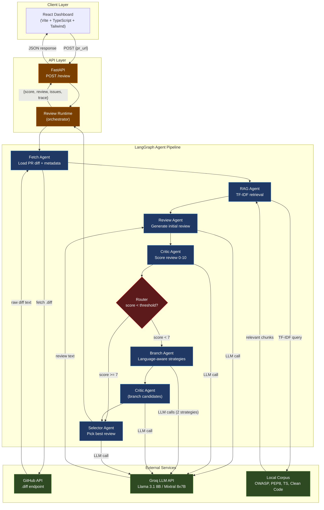

# PR Critic — Architecture Blueprint

**Multi-Agent Pull Request Review System**

| | |
|---|---|
| Document type | Architecture Blueprint |
| Project | PR Critic |
| Stack | FastAPI · LangGraph · React · Groq |

---

## Table of Contents

1. [System Overview](#1-system-overview)
2. [Architecture Diagram](#2-architecture-diagram)
3. [Component Breakdown](#3-component-breakdown)
4. [Agent Design](#4-agent-design)
5. [Data Flow](#5-data-flow)
6. [Technology Decisions](#6-technology-decisions)
7. [Observability](#7-observability)
8. [Security Posture](#8-security-posture)
9. [Appendix — Repository Layout](#appendix--repository-layout)

---

## 1. System Overview

PR Critic is a production-oriented, multi-agent AI system that performs automated pull request reviews. Given a PR diff URL, the system fetches the diff, enriches it with domain-specific retrieval context, generates a structured code review using a large language model, scores that review using a separate critic agent, and conditionally branches into alternative review strategies if the quality score falls below a configurable threshold. A selector agent then chooses the best review from all candidates and returns a structured JSON response consumed by a React dashboard.

### 1.1 Core Use Case

Software engineering teams spend significant review cycles on repetitive quality issues: missing type annotations, insecure patterns, style violations, and logic errors that could be caught automatically. PR Critic augments human reviewers by providing an instant, structured first-pass review that surfaces actionable findings before the PR enters the human review queue. This reduces review latency and allows human reviewers to focus on architecture and business logic rather than mechanical quality gates.

### 1.2 Problem Statement

A single LLM call for code review is insufficient for production use because it lacks self-correction, domain-specific grounding, and quality validation. PR Critic solves this with a multi-agent pipeline that separates concerns: retrieval, generation, evaluation, and selection are handled by dedicated agents with distinct prompts, models, and responsibilities.

### 1.3 Key System Properties

> - **Multi-agent pipeline** — 6 specialised agents with distinct roles and prompts
> - **RAG-grounded** — reviews are enriched with OWASP, PEP 8, TypeScript, and Clean Code guidance
> - **Self-evaluating** — a critic agent scores every review and triggers branching when quality is insufficient
> - **Language-aware** — branch strategies adapt to the detected programming language of the PR
> - **Observable** — every agent emits structured trace events consumed by the frontend dashboard
> - **Testable** — 20-scenario evaluation framework with mock and live modes; 28+ unit and integration tests

---

## 2. Architecture Diagram

### 2.1 Component Overview

| Layer | Component | Technology | Deployment |
|---|---|---|---|
| Client | React Dashboard | React 18, Vite, TypeScript, Tailwind | Vercel (CDN) |
| API | REST Endpoint | FastAPI, Uvicorn, Pydantic | Render / local |
| Orchestration | Agent Pipeline | LangGraph (StateGraph) | In-process |
| Retrieval | RAG Engine | TF-IDF, custom corpus | In-process |
| LLM | Inference Provider | Groq (Llama 3.1) | External API |
| Source Control | GitHub API | REST, .diff endpoint | External API |

### 2.2 System Architecture Diagram



---

## 3. Component Breakdown

### 3.1 Frontend — React Dashboard

| Attribute | Detail |
|---|---|
| **Responsibility** | Capture PR URL input; render score, strategies, issues, trace, and diff panels; display pipeline execution timeline |
| **Technologies** | React 18, Vite, TypeScript, Tailwind CSS, custom hooks (`useReviewState`) |
| **Why React + Vite** | Component model maps cleanly to the multi-panel dashboard. Vite provides sub-second HMR for development. TypeScript catches API contract drift at compile time. |
| **Why Vercel** | Zero-config CDN deployment for a static SPA. Automatic preview deployments on every commit. No infra management. |
| **Key components** | `ScoreCard`, `StrategyList`, `IssuesList`, `TracePanel`, `DiffPanel`, `MetricsBar`, `PipelineLoader` |

### 3.2 Backend API — FastAPI

| Attribute | Detail |
|---|---|
| **Responsibility** | Expose `POST /review`, `GET /review/mock-prs`, `GET /health`; validate inputs; invoke the LangGraph pipeline; return structured JSON |
| **Technologies** | FastAPI, Uvicorn, Pydantic v2 (settings and I/O validation), Python 3.11 |
| **Why FastAPI** | Pydantic-native request/response validation, async-ready, auto-generated OpenAPI docs, minimal boilerplate. Best-in-class for ML serving endpoints. |
| **Rate limiting** | 30 requests / 60 s window (configurable). Protects against LLM cost overruns. |
| **Caching** | TTL caches on PR fetch (120 s) and RAG results (300 s) to avoid redundant LLM and HTTP calls for repeated URLs. |

### 3.3 LangGraph Orchestration Layer

| Attribute | Detail |
|---|---|
| **Responsibility** | Define, compile, and execute the agent DAG; manage shared state across agents; route between branch and selector paths |
| **Technologies** | LangGraph (`StateGraph`), LangChain-Groq, TypedDict state schema |
| **Why LangGraph** | Explicit DAG definition prevents implicit coupling between agents. Conditional edges are first-class. State management is centralised and inspectable. Better than raw function chaining for multi-path workflows. |
| **Compiled graph** | The graph is compiled once at module import (`compiled_graph` singleton), not per request, saving ~20 ms of graph construction overhead per call. |

### 3.4 RAG Engine

| Attribute | Detail |
|---|---|
| **Responsibility** | Index the local corpus at startup; accept a query derived from the PR diff; return the top-K most relevant chunks |
| **Technologies** | TF-IDF vectoriser (scikit-learn), in-memory index, 5-document corpus |
| **Corpus documents** | OWASP Top 10, PEP 8, TypeScript best practices, React security patterns, Clean Code / review examples |
| **Why TF-IDF over vector DB** | The corpus is small and stable (5 documents). TF-IDF is deterministic, zero-latency, and has no infrastructure dependency. ChromaDB would add operational complexity without proportionate benefit at this scale. See trade-offs in Section 6. |

### 3.5 External Services

| Service | Usage | Notes |
|---|---|---|
| **Groq LLM API** | Review, Critic, Branch, Selector agents | Llama 3.1 8B Instant for generation (low latency, cost-efficient); Llama 3.1 8B for reasoning. Per-agent temperature tuning. |
| **GitHub API** | Fetch Agent — load raw `.diff` | Supports both live GitHub diff URLs and `mock://` URLs for local testing. Optional `GITHUB_TOKEN` for private repos. |

---

## 4. Agent Design

### 4.1 Agent Pipeline Summary

| Agent | Model profile | Primary input | Responsibility |
|---|---|---|---|
| `fetch_agent` | No LLM | `pr_url` | Load PR diff and metadata (title, language, files changed) from GitHub or mock store |
| `rag_agent` | No LLM | `pr_diff`, language | Query TF-IDF index; return top-K relevant coding standard chunks as `retrieved_context` |
| `review_agent` | Generation (temp 0.2) | diff, context, metadata | Produce an initial structured code review covering correctness, security, style, and maintainability |
| `critic_agent` | Reasoning (temp 0.1) | review text, diff | Score the review 0–10 across usefulness, coverage, false positives, and clarity; set `trigger_branch` flag |
| `branch_agent` | Generation (temp 0.5) | diff, language, context | Generate 2 language-specific alternative reviews using specialised strategy prompts |
| `selector_agent` | Reasoning (temp 0.1) | all candidates + scores | Select the highest-quality candidate; return `best_candidate` and `selector_rationale` |

### 4.2 Why Multi-Agent Instead of a Single LLM Call

| Problem with a single call | Multi-agent solution |
|---|---|
| No quality control | The critic agent independently evaluates every generated review against four rubric dimensions before it is returned to the user |
| No retrieval grounding | The RAG agent injects domain-specific guidance (OWASP, PEP 8) before the review prompt, reducing hallucinated suggestions |
| Single-strategy output | The branch agent generates alternative strategy-specific reviews when the initial quality is insufficient, allowing the selector to pick the best |
| No self-correction loop | The critic → branch → critic subgraph implements a self-correction loop: low-quality reviews trigger re-generation with refined strategy prompts |
| No separation of concerns | Each agent has a single, well-defined responsibility. Prompts, model parameters, and temperatures are tuned independently per agent role |

### 4.3 Branch Agent Strategy Selection

The branch agent selects strategies based on the detected programming language of the PR:

- **TypeScript / JavaScript** → `security_focus` + `typescript_idioms`
- **Python** → `security_focus` + `python_idioms`
- **All other languages** → `security_focus` + `correctness_focus`

`security_focus` is always included because security vulnerabilities represent the highest-impact class of review finding. Language-specific strategies maximise the relevance of the alternative review to the PR's actual codebase.

### 4.4 Critic Agent Scoring Rubric

The critic agent scores every review on four dimensions:

| Dimension | Max score | Measures |
|---|---|---|
| Usefulness | 3 | Are suggestions actionable and specific? |
| Coverage | 3 | Are the important issues addressed? |
| False positives | 2 | Does it avoid flagging non-issues? |
| Clarity | 2 | Is it clearly written? |
| **Total** | **10** | |

A score below the configurable threshold (default: **7**) triggers the branch path.

---

## 5. Data Flow

### 5.1 Step-by-Step Request Lifecycle

| Step | Component | Action |
|---|---|---|
| 1 | React UI | User enters a GitHub PR diff URL and submits. The frontend posts `{ pr_url }` to `POST /review` and displays the `PipelineLoader` animation. |
| 2 | FastAPI | Request is validated by Pydantic. Rate limiter is checked. The review runtime invokes the compiled LangGraph graph with the initial `PRCriticState`. |
| 3 | `fetch_agent` | Fetches the raw diff from GitHub (or resolves `mock://`). Detects language from file extensions. Populates `pr_diff` and `pr_metadata` in state. |
| 4 | `rag_agent` | Queries the TF-IDF index with the diff text + language. Returns top-3 relevant corpus chunks as `retrieved_context`. Sources list is stored for display. |
| 5 | `review_agent` | Constructs a review prompt incorporating the diff, metadata, and retrieved context. Calls Groq (generation model). Returns structured review text as the initial candidate. |
| 6 | `critic_agent` | Evaluates the review against the diff using the rubric prompt. Parses the JSON score response. Sets `trigger_branch=True` if `score < threshold`. |
| 7a _(high score)_ | `selector_agent` | If `score >= 7`: selector receives the single candidate and returns it as `best_candidate` with a rationale. Pipeline ends. |
| 7b _(low score)_ | `branch_agent` | If `score < 7`: generates up to 2 alternative reviews using language-specific strategy prompts. Appends to `candidates` list. |
| 8b | `critic_agent` | Re-scores each branch candidate independently. Updates candidate scores in state. |
| 9b | `selector_agent` | Receives all candidates (initial + branch). Selects the highest-scoring one. Returns `best_candidate` and `selector_rationale`. |
| 10 | FastAPI | Transforms final state into the API response contract: `{ score, strategies, selected_strategy, review, issues, trace }`. |
| 11 | React UI | Renders score card, strategy list, issue panel, review markdown, and execution trace. Analysis complete. |

### 5.2 Shared State Schema

All agents read from and write to a shared `PRCriticState` TypedDict — the single source of truth flowing through the LangGraph pipeline:

```python
pr_url              str         # Input PR diff URL
pr_diff             str         # Raw unified diff text
pr_metadata         dict        # title, author, files_changed, language
retrieved_context   str         # Top-K corpus chunks from RAG agent
retrieval_sources   list[str]   # Names of matched corpus documents
candidates          list[...]   # All generated review candidates
trigger_branch      bool        # Set by critic when score < threshold
best_candidate      dict|None   # Final selected review + score
selector_rationale  str         # Why the selector chose this candidate
trace               list[...]   # Structured agent execution events
```

### 5.3 API Response Contract

```json
{
  "score": 8.5,
  "strategies": [
    {
      "id": "initial",
      "name": "Balanced Review",
      "score": 8.5,
      "description": "Balanced review covering correctness, security, style, and maintainability."
    }
  ],
  "selected_strategy": "initial",
  "review": "## Summary\n...",
  "issues": [
    {
      "severity": "critical",
      "file": "auth/utils.py",
      "line": 4,
      "message": "MD5 is cryptographically broken. Use bcrypt or argon2 instead."
    }
  ],
  "trace": [
    {
      "agent": "fetch_agent",
      "level": "INFO",
      "message": "fetch_agent completed: language=Python, diff_length=412, in 23ms",
      "timestamp": "2026-04-13T15:54:06.892849+00:00"
    }
  ]
}
```

---

## 6. Technology Decisions

### 6.1 Decision Matrix

| Decision | Chosen | Alternative considered | Rationale |
|---|---|---|---|
| Agent orchestration | **LangGraph** | LangChain LCEL chains | LangGraph provides explicit DAG definition with conditional edges and centralised state. LCEL chains lack native branching and state management for multi-path workflows. |
| LLM provider | **Groq (Llama 3.1)** | OpenAI GPT-4o | Groq delivers sub-100 ms token latency via dedicated inference hardware. For a code review tool, latency directly impacts UX. Cost is also significantly lower. |
| Retrieval strategy | **TF-IDF (in-memory)** | ChromaDB (vector store) | Corpus has 5 stable documents. TF-IDF is deterministic, zero-latency, and has no infrastructure dependency. ChromaDB would add operational complexity without proportionate benefit at this scale. |
| API framework | **FastAPI** | Flask, Django REST | Pydantic-native validation, async support, and auto-generated docs. Best-suited for ML serving endpoints. Flask lacks type safety; Django adds unnecessary overhead. |
| Frontend build | **Vite + React 18** | Create React App, Next.js | Vite provides near-instant HMR. CRA is deprecated. Next.js SSR is unnecessary for a client-only dashboard consuming a local API. |
| Deployment (FE) | **Vercel** | Netlify, GitHub Pages | Best Vite integration, instant global CDN, and zero-config deployment. Preview URLs per PR are a natural fit for a PR review tool. |
| Model profiles | **Two profiles (gen + reasoning)** | Single model for all agents | Generation agents (review, branch) use temperature 0.2–0.5 for creative variability. Evaluation agents (critic, selector) use temperature 0.1 for deterministic scoring. Separation improves result quality. |

### 6.2 Known Trade-offs

#### TF-IDF vs. Vector Database

> **Trade-off:** TF-IDF performs exact keyword matching, so it may miss semantically related content that uses different vocabulary. For example, a diff containing `os.system()` will retrieve the OS command injection OWASP chunk correctly (keyword match), but a diff about a subtle race condition may not retrieve the relevant concurrency guidance if it uses different terminology.
>
> **Mitigation:** The corpus documents are written with diverse keyword coverage for common patterns. For a production V2, migrating to ChromaDB with `text-embedding-3-small` would improve semantic recall without significant latency impact.

#### Synchronous Pipeline Execution

> **Trade-off:** The pipeline executes agents sequentially within a single request. For long diffs with branching, total latency can reach 10–15 seconds due to 5–6 serial LLM calls.
>
> **Mitigation:** Branch agent strategies are currently generated sequentially. A V2 could parallelise branch candidate generation using `asyncio.gather()`, reducing branch latency by ~50%. LangGraph supports async nodes natively.

#### Mock vs. Live GitHub Integration

> **Trade-off:** The current MCP layer uses a mock GitHub store for local development and testing. Live mode fetches real `.diff` URLs but does not use GitHub's GraphQL API for richer PR metadata (labels, review history, linked issues).
>
> **Mitigation:** A production integration would use the GitHub Apps API with OAuth, enabling access to private repositories, PR context, and webhooks for automated triggering.

---

## 7. Observability

### 7.1 Trace Event System

Every agent emits structured trace events to the shared state. These events are returned in the API response and rendered as an execution timeline in the frontend `TracePanel`.

| Event type | Emitted by | Payload fields |
|---|---|---|
| `start` | All agents | `agent`, `level`, `message`, `timestamp` |
| `end` | All agents | `agent`, `level`, `message`, `timestamp`, `duration_ms`, key metrics |
| `routing` | `critic_agent` | `decision` (branch\|select), `score`, `threshold` |
| `error` | All agents | `agent`, `level: ERROR`, `message`, `timestamp` |

### 7.2 Trace Event Example

```json
{
  "agent": "critic_agent",
  "level": "INFO",
  "message": "critic_agent completed: strategy=initial, score=4.2, trigger_branch=true, in 1847ms",
  "timestamp": "2026-04-13T15:54:08.123Z"
}
```

### 7.3 Observability Coverage

- Every agent call is bracketed by `start` and `end` events with wall-clock duration
- Routing decisions are logged with the score, threshold, and path chosen
- LLM call failures are caught and emitted as `error` events; the pipeline degrades gracefully
- Retrieval sources are captured in state and displayed in the frontend for transparency
- GitHub Actions CI publishes `coverage.xml` and `evaluation/results.json` as build artifacts
- The `/health` endpoint exposes service status and runtime metadata for uptime monitoring

### 7.4 Evaluation Framework

A separate evaluation framework (`evaluation/scenarios.py` + `evaluation/metrics.py`) provides repeatable, quantitative measurement of pipeline quality independent of the unit test suite.

| Metric | Description |
|---|---|
| `avg_score` | Mean critic score (0–10) across all successful runs |
| `branching_rate_pct` | Percentage of runs that triggered the branch path |
| `category_avg_score` | Per-category breakdown: security, style, design, edge, adversarial |
| `avg_latency_ms` | Mean end-to-end pipeline duration in milliseconds |
| `success_rate_pct` | Percentage of scenarios completed without error |
| `strategy_distribution` | Which selector strategies were chosen most frequently |

Run in mock mode (no API key required):

```bash
python scripts/run_evaluation.py --mock
```

Run against live models:

```bash
python scripts/run_evaluation.py --delay 1.0
```

Results are written to `evaluation/results.json`.

---

## 8. Security Posture

| Control | Implementation |
|---|---|
| **No credentials in repository** | `GROQ_API_KEY` and `GITHUB_TOKEN` are loaded exclusively from environment variables via Pydantic `BaseSettings`. The `.env` file is gitignored. |
| **Prompt injection resistance** | Adversarial content in PR diffs (embedded system prompt overrides) is mitigated by the critic agent's independent scoring. An injected `"score: 10"` instruction in the diff cannot override the critic's rubric evaluation. Negative test cases validate this. |
| **Input validation** | All API inputs are validated by Pydantic before the pipeline is invoked. Malformed URLs, null bytes, and oversized inputs are handled gracefully without crashing the pipeline. |
| **Rate limiting** | The API applies a 30 req / 60 s rate limit to prevent LLM cost overruns from automated or malicious callers. |
| **Diff truncation** | Agent prompts cap diff input at 2,000–3,500 characters to prevent prompt injection via oversized inputs and to stay within model context windows. |

---

## Appendix — Repository Layout

| Path | Contents |
|---|---|
| `backend/agents/` | One file per agent: fetch, rag, review, critic, branch, selector |
| `backend/api/` | FastAPI app, issue extractor, response contract |
| `backend/graph/` | LangGraph workflow, state schema, contracts |
| `backend/mcp/` | GitHub mock store, live GitHub client |
| `backend/rag/` | TF-IDF retriever, corpus indexing |
| `backend/observability/` | Structured logger, trace event builders |
| `backend/utils/` | TTL cache, resilience / retry utilities |
| `data/corpus/` | OWASP, PEP 8, TypeScript, React security, Clean Code documents |
| `evaluation/` | 20-scenario test suite, metrics module, `results.json` |
| `frontend/src/` | React components, hooks, types, API client |
| `tests/` | Unit, integration, adversarial, evaluation tests (1,316 lines) |
| `scripts/` | Evaluation runner, corpus builder |
| `.github/workflows/` | CI: pytest + coverage + evaluation on every push |

---

**Live deployment:** https://pr-critic.vercel.app  
**Repository:** https://github.com/n6s8/pr-critic